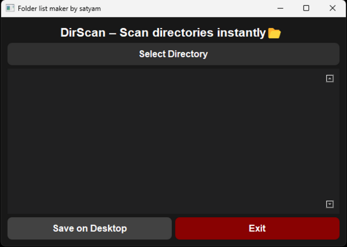

# 🚀 FileSentry - v2.0 (without ui)
  

## 🔍 About  
**Name Finder UI** is a simple and intuitive application designed to help users search and list file names within a selected directory. With a sleek and modern UI, this tool provides an efficient way to organize and access files.  

## 🖥️ Features  
- Select a directory to scan for files.  
- Display the list of files in a structured format.  
- Save the list to a text file for future reference.  
- User-friendly interface with dark mode.  

## 🖥️ Screenshot of the app after running
  

## 🚀 Installation  

### 🏷️ Download Executable  
For Windows users, download the pre-built **.exe** file:  
🔗 [Download Name Finder UI (Windows)](https://www.mediafire.com/file/s27l2ph2vjwler6/list+maker.exe/file)  

### 🛠️ Running from Source  
#### Prerequisites  
- **Windows 10/11** (⚠️ *This UI version of application currently supports only Windows*)  
- Python 3.7+ installed  
- Required dependencies:
  ```sh
  pip install -r requirements.txt

  
#### Running the Application  
1. Clone or download the repository.  
2. Navigate to the project directory.  
3. Run the python file using:
    ```sh 
    python name_finder.py

## 💡 Lightweight Non-UI Version (Supports Windows & Linux)  
For a **lightweight and faster** command-line version that works on both **Windows and Linux**, check out the non-UI version here:  
🔗 [GitHub: Folder & File List Maker (CLI Version)](https://github.com/satyam-64136/folder-file-list-maker.git)  

## 🛠️ Technologies Used  
- Python (PyQt5 for UI)   

## 📌 Notes  
- Ensure you have the necessary permissions to access directories.  

## 📜 License  
This project is open-source under the MIT License.

---
💡 **Developed by Satyam** | 🚀 Happy Coding!  
